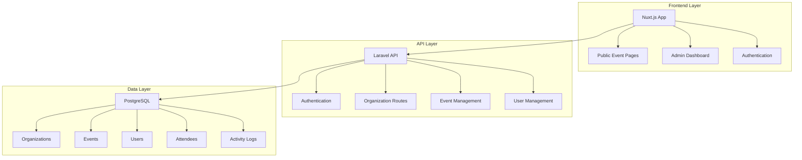

# 🎪 Multi-Tenant Event Management System

<div align="center">

[](https://php.net)
[](https://laravel.com)
[](https://vuejs.org)
[](https://nuxt.com)
[](https://postgresql.org)
[](https://tailwindcss.com)

*A comprehensive, scalable multi-tenant event management platform built with modern web technologies*

[🚀 Demo](https://solutechify.vercel.app/) • [📋 Features](https://github.com/joseph3559/Solutechify/blob/main/docs/architecture/multi-tenant.md) • [🛠️ Installation](https://github.com/joseph3559/Solutechify/blob/main/docs/getting-started/quick-start.md) • [📚 API Documentation](https://github.com/joseph3559/Solutechify/blob/main/docs/api-reference/events.md) • [🤝 Contributing](#-contributing)

</div>

---

## 📖 Overview

This multi-tenant event management system provides organizations with a powerful platform to manage events, track attendees, and handle registrations. Built with a Laravel API backend and Nuxt.js frontend, the system ensures complete data isolation between organizations while maintaining a seamless user experience.

### 🎯 Key Highlights

- **🏢 Multi-Tenancy**: Complete organization-based data isolation
- **🔐 Secure Authentication**: JWT-based with role management
- **📱 Responsive Design**: Beautiful, mobile-first interface
- **⚡ Real-time Updates**: Dynamic attendee tracking
- **📊 Comprehensive Analytics**: Event statistics and reporting
- **🛡️ Enterprise Security**: Role-based access control
- **🎨 Modern UI/UX**: Intuitive admin dashboard and public interface

---

## ✨ Features

### 🌟 Core Functionality

| Feature | Description |
|---------|-------------|
| **Multi-Tenant Architecture** | Complete organization isolation with shared infrastructure |
| **Event Management** | Full CRUD operations for events with capacity management |
| **User Registration** | Seamless public registration with form validation |
| **Admin Dashboard** | Comprehensive management interface with analytics |
| **Activity Logging** | Complete audit trail of all system activities |
| **Soft Deletes** | Safe data removal with recovery options |
| **Real-time Analytics** | Live attendee counts and revenue tracking |

### 🔒 Security Features

- **JWT Authentication** with Laravel Sanctum
- **Role-based Access Control** (Admin/Public)
- **Organization-based Authorization**
- **Input Validation & Sanitization**
- **CSRF Protection**
- **SQL Injection Prevention**

### 🎨 User Experience

- **Responsive Design** (Mobile, Tablet, Desktop)
- **Intuitive Navigation** with breadcrumbs
- **Form Validation** with real-time feedback
- **Loading States** and error handling
- **Accessibility** compliant interface
- **Dark/Light Mode** support

---

## 🏗️ System Architecture



---

## 🗄️ Database Schema

### 📊 Core Models

#### Organizations
```sql
organizations:
├── id (Primary Key)
├── name (Organization Name)
├── slug (URL-friendly identifier)
├── domain (Custom domain support)
├── email (Contact email)
├── phone (Contact number)
├── address (Physical address)
├── logo (Logo URL)
├── is_active (Status flag)
├── created_at
├── updated_at
└── deleted_at (Soft delete)
```

#### Events
```sql
events:
├── id (Primary Key)
├── organization_id (Foreign Key)
├── title (Event name)
├── description (Event details)
├── venue (Location)
├── date (Event date/time)
├── price (Ticket price)
├── max_attendees (Capacity)
├── current_attendees (Current count)
├── is_active (Status flag)
├── created_at
├── updated_at
└── deleted_at (Soft delete)
```

#### Users
```sql
users:
├── id (Primary Key)
├── organization_id (Foreign Key)
├── name (Full name)
├── email (Unique email)
├── password (Hashed)
├── role (admin/user)
├── email_verified_at
├── created_at
└── updated_at
```

#### Attendees
```sql
attendees:
├── id (Primary Key)
├── event_id (Foreign Key)
├── name (Attendee name)
├── email (Contact email)
├── phone (Contact number)
├── status (registered/confirmed/cancelled)
├── created_at
└── updated_at
```

### 🔗 Relationships

- **Organization** → **Events** (One-to-Many)
- **Organization** → **Users** (One-to-Many)
- **Event** → **Attendees** (One-to-Many)
- **User** → **Organization** (Many-to-One)

---

## 🚀 API Documentation

### 🔗 Base URL
```
http://localhost:8000/api
```

### 🔐 Authentication

All admin endpoints require Bearer token authentication:

```bash
Authorization: Bearer {jwt_token}
```

### 📋 Endpoints

#### Public Endpoints

| Method | Endpoint | Description | Parameters |
|--------|----------|-------------|------------|
| `GET` | `/organizations` | List all organizations | - |
| `GET` | `/organizations/{slug}/events` | Get organization events | `slug`: organization identifier |
| `POST` | `/organizations/{slug}/events/{id}/register` | Register for event | Event registration data |

#### Authentication Endpoints

| Method | Endpoint | Description | Parameters |
|--------|----------|-------------|------------|
| `POST` | `/login` | Admin login | `email`, `password` |
| `GET` | `/user` | Get authenticated user | - |

#### Admin Endpoints

| Method | Endpoint | Description | Auth Required |
|--------|----------|-------------|---------------|
| `GET` | `/organizations/{org}/events` | List organization events | ✅ |
| `POST` | `/organizations/{org}/events` | Create new event | ✅ |
| `PUT` | `/organizations/{org}/events/{id}` | Update event | ✅ |
| `DELETE` | `/organizations/{org}/events/{id}` | Delete event | ✅ |
| `GET` | `/organizations/{org}/events/{id}/attendees` | List event attendees | ✅ |

### 📝 Request/Response Examples

#### Event Registration
```bash
POST /api/organizations/tech-events/events/1/register
Content-Type: application/json

{
    "name": "John Doe",
    "email": "john@example.com",
    "phone": "+1234567890"
}
```

#### Admin Login
```bash
POST /api/login
Content-Type: application/json

{
    "email": "admin@tech-events.com",
    "password": "password"
}
```

#### Create Event
```bash
POST /api/organizations/1/events
Authorization: Bearer {token}
Content-Type: application/json

{
    "title": "Tech Conference 2025",
    "description": "Annual technology conference",
    "venue": "Convention Center",
    "date": "2025-12-15T09:00:00Z",
    "price": 150.00,
    "max_attendees": 500
}
```

---

## 🛠️ Installation

### 📋 Prerequisites

- **PHP 8.2+** with extensions: `pdo`, `pdo_pgsql`, `mbstring`, `openssl`
- **Composer** 2.0+
- **Node.js** 18+ and **npm**
- **PostgreSQL** 15+
- **Git**

### ⚡ Quick Start

1. **Clone the repository**
   ```bash
   git clone https://github.com/your-username/event-management-system.git
   cd event-management-system
   ```

2. **Backend Setup**
   ```bash
   cd backend
   composer install
   cp .env.example .env
   php artisan key:generate
   ```

3. **Database Configuration**
   ```bash
   # Create PostgreSQL database
   sudo -u postgres createdb event_management
   
   # Update .env file
   DB_CONNECTION=pgsql
   DB_HOST=127.0.0.1
   DB_PORT=5432
   DB_DATABASE=event_management
   DB_USERNAME=postgres
   DB_PASSWORD=your_password
   ```

4. **Run Migrations & Seed Data**
   ```bash
   php artisan migrate:fresh --seed
   ```

5. **Frontend Setup**
   ```bash
   cd ../frontend
   npm install
   ```

6. **Start Development Servers**
   ```bash
   # Terminal 1 - Backend
   cd backend
   php artisan serve
   
   # Terminal 2 - Frontend
   cd frontend
   npm run dev
   ```

### 🌐 Access Points

- **Frontend**: http://localhost:3000
- **Backend API**: http://localhost:8000/api
- **Admin Dashboard**: http://localhost:3000/admin

---

## 👥 Sample Data

The system comes with pre-seeded sample data:

### 🏢 Organizations

| Organization | Slug | Admin Email | Description |
|--------------|------|-------------|-------------|
| **Tech Events Co** | `tech-events` | admin@tech-events.com | Technology conferences and meetups |
| **Cultural Events** | `cultural-events` | admin@cultural-events.com | Art, music, and cultural gatherings |
| **Business Meetups** | `business-meetups` | admin@business-meetups.com | Professional networking events |

### 🔑 Admin Credentials

All admin accounts use the password: `password`

### 📅 Sample Events

Each organization includes 4 sample events:
- Annual Conference
- Networking Mixer
- Workshop Sessions
- Startup Pitch Night

---

## 🔧 Technology Stack

### Backend

| Technology | Purpose | Version |
|------------|---------|---------|
| **Laravel** | PHP Framework | 12.0+ |
| **PostgreSQL** | Primary Database | 15+ |
| **Laravel Sanctum** | API Authentication | 4.1+ |
| **Spatie Activity Log** | Audit Logging | 4.10+ |
| **Stancl Tenancy** | Multi-tenancy | 3.9+ |

### Frontend

| Technology | Purpose | Version |
|------------|---------|---------|
| **Nuxt.js** | Vue.js Framework | 3.17+ |
| **Vue.js** | JavaScript Framework | 3.4+ |
| **Tailwind CSS** | CSS Framework | 3.4+ |
| **Pinia** | State Management | 0.11+ |
| **Axios** | HTTP Client | 1.9+ |
| **Heroicons** | Icon Library | 2.2+ |

### Development Tools

- **Vite** - Build tool
- **ESLint** - Code linting
- **Prettier** - Code formatting
- **TypeScript** - Type safety

---

## 🚦 Usage Guide

### 🌍 Public User Journey

1. **Browse Organizations**
   - Visit the homepage
   - View all available organizations
   - Click on any organization card

2. **Explore Events**
   - Browse upcoming events for the organization
   - View event details (date, venue, price, capacity)
   - Check available spots

3. **Register for Events**
   - Click "Register Now" on any event
   - Fill out the registration form
   - Receive confirmation

### ⚙️ Admin User Journey

1. **Login**
   - Navigate to `/admin/login`
   - Use organization admin credentials
   - Access the admin dashboard

2. **Dashboard Overview**
   - View key metrics (total events, attendees, revenue)
   - Quick access to recent activities
   - Organization-specific analytics

3. **Event Management**
   - Create new events with all details
   - Edit existing event information
   - View and manage attendee lists
   - Delete events (soft delete)

4. **Analytics & Reporting**
   - Track event performance
   - Monitor registration trends
   - Export attendee data

---

## 🔒 Security Considerations

### 🛡️ Authentication & Authorization

- **JWT tokens** with configurable expiration
- **Role-based access control** (RBAC)
- **Organization-based data isolation**
- **Password hashing** with bcrypt

### 🔐 Data Protection

- **Input validation** on all forms
- **SQL injection prevention** via Eloquent ORM
- **XSS protection** with output escaping
- **CSRF tokens** on state-changing operations

### 🌐 API Security

- **Rate limiting** on API endpoints
- **CORS configuration** for cross-origin requests
- **Request validation** with Laravel Form Requests
- **Error handling** without information leakage

---

## 📈 Performance Optimization

### ⚡ Backend Optimizations

- **Database indexing** on frequently queried columns
- **Eager loading** to prevent N+1 queries
- **Query optimization** with Laravel Debugbar
- **Caching strategies** for static data

### 🎨 Frontend Optimizations

- **Code splitting** with Nuxt.js auto-imports
- **Image optimization** with lazy loading
- **Bundle optimization** with Vite
- **CDN support** for static assets

---

## 🧪 Testing

### 🔬 Backend Testing

```bash
# Run all tests
php artisan test

# Run specific test suite
php artisan test --testsuite=Feature

# Generate coverage report
php artisan test --coverage
```

### 🎭 Frontend Testing

```bash
# Run unit tests
npm run test

# Run e2e tests
npm run test:e2e

# Run tests with coverage
npm run test:coverage
```

---

## 🚀 Deployment

### 🐳 Docker Deployment

```dockerfile
# Use provided docker-compose.yml
docker-compose up -d
```

### ☁️ Cloud Deployment

Supports deployment on:
- **AWS** (EC2, RDS, S3)
- **DigitalOcean** (Droplets, Managed Databases)
- **Heroku** (with PostgreSQL add-on)
- **Vercel/Netlify** (Frontend)

### 🔧 Environment Configuration

```bash
# Production environment variables
APP_ENV=production
APP_DEBUG=false
APP_URL=https://solutechify.com

DB_CONNECTION=pgsql
DB_HOST=your-db-host
DB_DATABASE=event_management
DB_USERNAME=your-db-user
DB_PASSWORD=your-secure-password

# Additional security settings
SESSION_SECURE_COOKIE=true
SANCTUM_STATEFUL_DOMAINS=solutechify.com
```

---

## 🤝 Contributing

We welcome contributions! Please see our [Contributing Guidelines](CONTRIBUTING.md) for details.

### 🌟 How to Contribute

1. **Fork** the repository
2. **Create** a feature branch (`git checkout -b feature/amazing-feature`)
3. **Commit** your changes (`git commit -m 'Add amazing feature'`)
4. **Push** to the branch (`git push origin feature/amazing-feature`)
5. **Open** a Pull Request

### 📝 Development Guidelines

- Follow **PSR-12** coding standards for PHP
- Use **ESLint** configuration for JavaScript/TypeScript
- Write **comprehensive tests** for new features
- Update **documentation** for API changes
- Follow **conventional commits** for messages

---

## 📋 Roadmap

### 🎯 Upcoming Features

- [ ] **Email Notifications** - Event reminders and confirmations
- [ ] **Payment Integration** - Stripe/PayPal for paid events
- [ ] **Calendar Integration** - Google Calendar, Outlook sync
- [ ] **QR Code Check-in** - Mobile check-in system
- [ ] **Advanced Analytics** - Detailed reporting dashboard
- [ ] **Mobile App** - React Native companion app
- [ ] **API Rate Limiting** - Enhanced security measures
- [ ] **Webhook Support** - Third-party integrations

### 🔄 Version History

- **v1.0.0** - Initial release with core functionality
- **v1.1.0** - Enhanced admin dashboard (Planned)
- **v1.2.0** - Payment integration (Planned)

---

## 📄 License

This project is licensed under the **MIT License** - see the [LICENSE](LICENSE) file for details.

---

## 🙏 Acknowledgments

- **Laravel Team** - For the amazing PHP framework
- **Nuxt.js Team** - For the powerful Vue.js framework
- **Tailwind CSS** - For the utility-first CSS framework
- **Open Source Community** - For the incredible packages and tools

---

## 📞 Support

### 💬 Getting Help

- **Documentation**: Check this README and inline code comments
- **Issues**: [GitHub Issues](https://github.com/joseph3559/event-management-system/issues)
- **Discussions**: [GitHub Discussions](https://github.com/joseph3559/event-management-system/discussions)
- **Email**: support@solutechify.com

### 🐛 Bug Reports

When reporting bugs, please include:
- **Operating System** and version
- **PHP/Node.js** versions
- **Browser** and version (for frontend issues)
- **Steps to reproduce** the issue
- **Expected vs actual** behavior
- **Screenshots** if applicable

---

<div align="center">

**Built with ❤️ by [Joseph Maina](https://github.com/joseph3559)**

⭐ **Star this repository if it helped you!** ⭐

</div>
